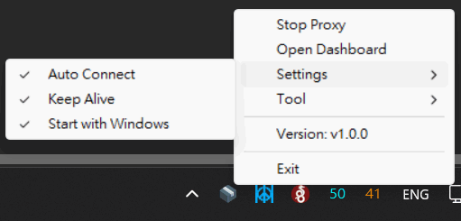
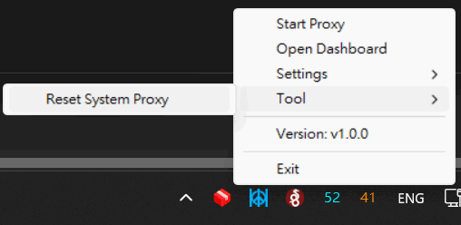

# Singbox Tray Monitor

`Singbox Tray Monitor` is a basic and lightweight system tray tool designed specifically for Windows. Providing background process management status monitoring for the [Sing-box](https://github.com/sagernet/sing-box) core.

---

## Usage

Download the [lastest release](https://github.com/tsoiisaiah/SingboxTrayMonitor/releases/latest), and put it together with `sing-box.exe`.

You may also put it anywhere you want and update `config.ini`

---

## Screenshoot






## Core Features

1. **Monitor Singbox process**  
   Monitor singbox process, support auto start and keep alive functionality.
2. **Status Tray Icon**  
   Tray icon reflecting the sing-box status
3. **Simple UI for the basics**  
   Simple UI to achieve basic need to interact with Sing-box.
4. **Dashboard shortcut**  
   One-click shortcut to open dashboard. `config.ini` will be scanned and disable if `external_ui` is not set.
5. **Portable, Core and dashboard of your choice**  
   No dependency on core and dashboard, user can always use the core and dashboard of their choice.
6. **Reset System Proxy**  
   One click to reset proxy registry, useful if sing-box instance is killed unexpectedly.

---

## Configuration Guides

### 1. Tray Configuration (`config.ini`)
Upon the initial launch, config.ini will automatically generated

```ini
api_url=127.0.0.1:9090
exe_path=sing-box.exe
config_path=config.json
auto_connect=true
keep_alive=true
start_with_windows=false
```

* `api_url`: The clash api endpoint of the Sing-box backend.
* `exe_path`: Specifies the exact absolute or relative path to your `sing-box.exe`.
* `config_path`: Specifies the exact routing rule configuration file path for Sing-box.
* `auto_connect`: Determines whether to spawn the proxy core immediately when on starts.
* `keep_alive`: If enabled, the tool automatically start Sing-box in the background if the core unexpectedly crashes.
* `start_with_windows`: Registers to launch automatically upon Windows user logon.

### 2. Sing-box Profile (`config.json`)
This tool require enable `clash_api` in the profile. It is recommened to setup dashboard as well.

```json
{
  "experimental": {
    "clash_api": {
      "external_controller": "127.0.0.1:9090",
      "external_ui": "dashboard"
    },
  }
}
```

---

## Development

### 1. Run
```bash
go run .
```

### 3. Build
```bash
go build -ldflags="-w -s -H=windowsgui" -o SingboxTrayMonitor.exe .
```

---

## Disclaimer

1. **Personal Project**:  
This is a purely personal hobby project to fit my own specific networking workflows and requirements.
2. **Tested Environment**:  
This tool has only been actively tested using Sing-box core version `1.13.13` running on a Windows 11 environment. Compatibility with other core versions or operating systems is not guaranteed.
3. **No Warranty**:  
If anything breaks, causes network interruption, system instability, or data loss, it is entirely your own responsibility. The author holds absolute zero liability for any issues arising from the use of this tool.

---
